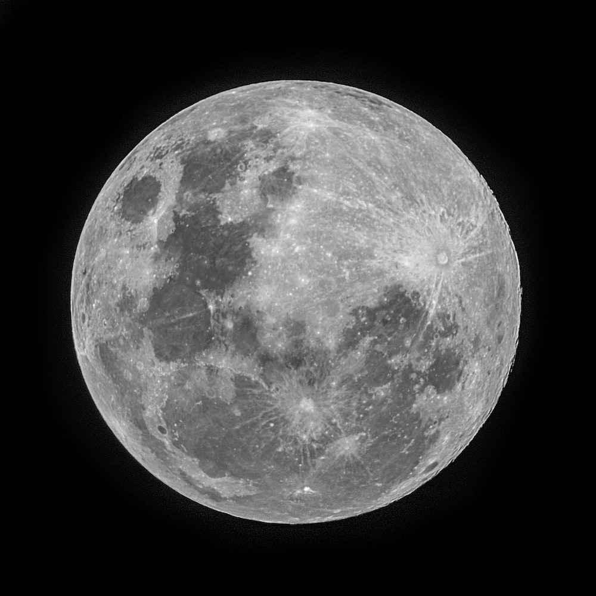
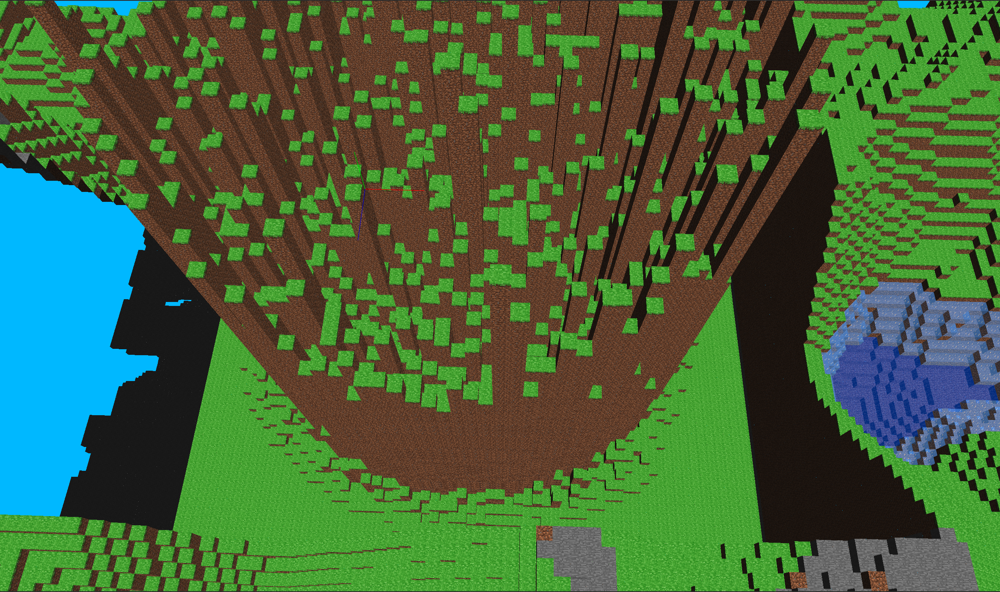
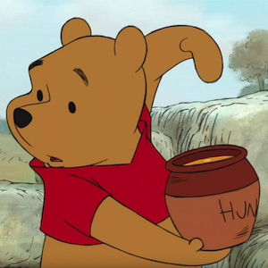
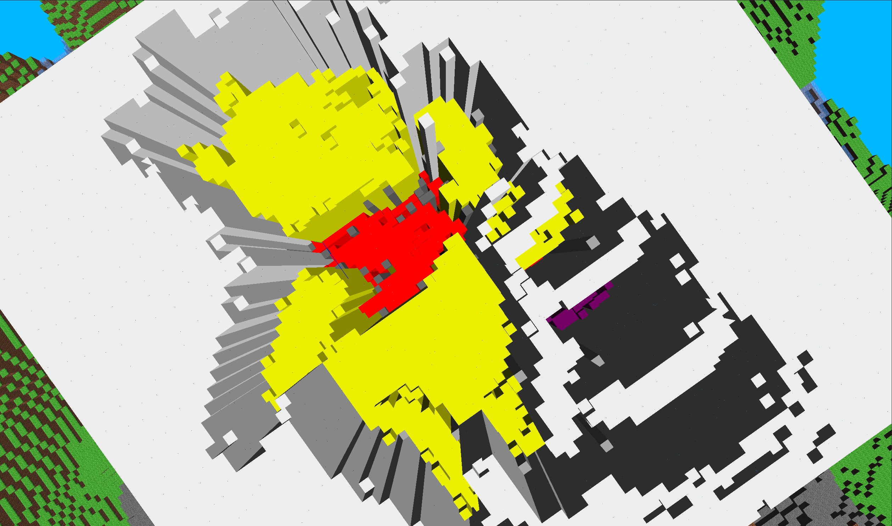
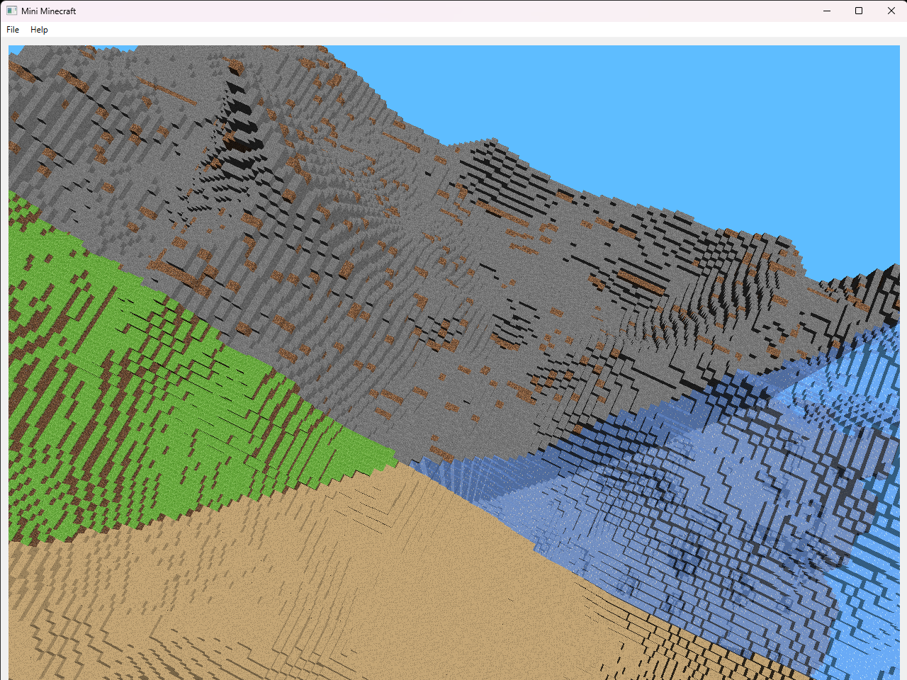
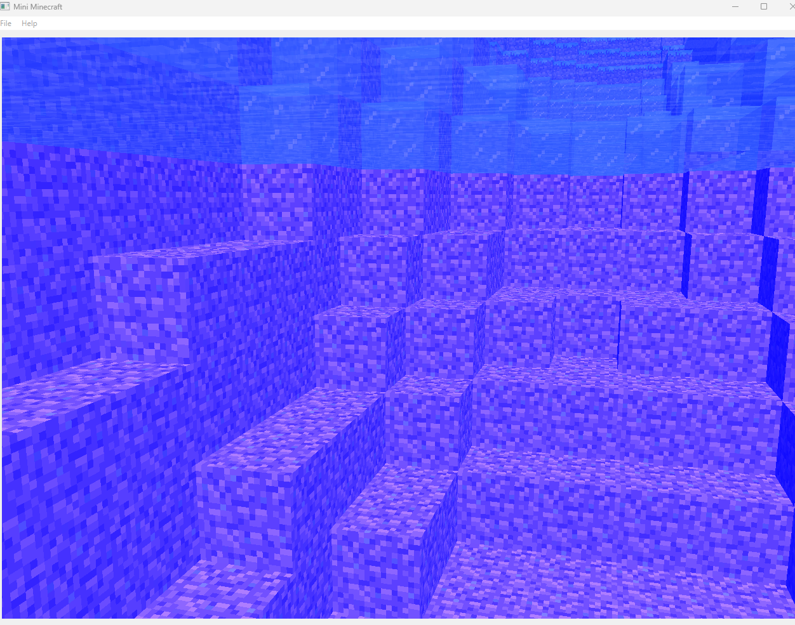
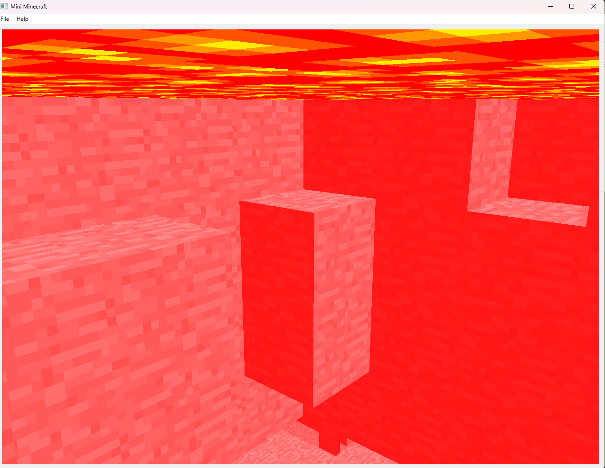

# Milestone 1

video: https://drive.google.com/file/d/1GdR3cALOKgeEULuy8uhoAGtN6J9UAyO7/view?usp=share_link

## Shiwei Ge (Procedural Terrain):

> To implement the noise function for the height of the mountain I used fractal brownian noise overtop of perlin noise. For the rolling hills I used Worley noise. To interpolate bewteen biomes I used Perlin noise with a very large grid size. When this perlin noise was above 0.5 that signified mountains and below signified rolling hills. In between 0.4 and 0.6 I interpolated with the glm::mix function to provide a smoother transition between the regions.To test the noise functions I created I modified my HW4 and using a shader. I also created two Biomes field. The first mountain field is from 0<x<32, 0<z<64. The second Grassland field is from 32<x<64, 0<z<64.If the block is above 200 and it is the top, the block will be snow with color {1,1,1}. And between 128 and 138, it will be water if it's empty.

## Yicheng Xia (Efficient Terrain Rendering and Chunking):

Instead of repeatedly drawing `Cube` instances to genereate the game scene, I made `Chunk` inherit from `Drawable` and implemented its virtual function `createVBOdata()`.
In `createVBOdata()`, vertex data are stored interleavedly in a format of `pos0nor0col0pos1nor1col1`, and index data are stored separately in another vector.

Then can we buffer data into VBOs.
In `ShaderProgram::drawInterleaved(Chunk &c)`, a given `Chunk` object is drawn using interleaved VBOs. The function is called in `draw(int minX, int maxX, int minZ, int maxZ, ShaderProgram *shaderProgram)` in `terrain.cpp`.

In `terrain.cpp`, the test scence are created in `instantiateChunkAt(int x, int z)` function instead.
After creating grass, mountains, and waters with noise functions, the chunk pointer in the function calls `createVBOdata()`.

Another function `generateTerrain(glm::vec3 pos)` in `terrain.cpp` is to check whether to instantiate a chunk at a specific `pos` and instantialize it when the proximity condition is met.
Following the guideline of milestone 1, I looped through the chunk field with a step of 16 blocks.
The function is called in `MyGL::renderTerrain()` with the player's position `mcr_position`.

Therefore, the rendering efficiency is greatly improved, supporting procedural terrain and interactive player functionnalities.

## Yilin Guo (Game Engine Tick Function and Player Physics):

In mygl, construct InputBundle to record events (keyPress, keyRelease, mouseMove) compute the delta-time and pass into player's function tick().

In player, first figure out the acceleration, base velocity and velocity limitation in each direction based on InputBundle and current player state. Following are some details:

> If player is not in FlightMode and pressed spacebar, add base vertical velocity (JumpVelocity) to m_velocity.y.
> If player's velocity is positive, its limitation is [0, MaxVelocity]; if is negative, limitation is [MinVelocity, 0]; if is zero, limitation is [MinVelocity, MaxVelocity].
> If player is not in FlightMode, it always subject to gravity (m_acceleration.y -= Gravity).
> If player is in process of transforming from GroundMode to FlightMode, add a FlyUpAcceleration to m_acceleration.y until reach FlightModeHeight.
> Player is subject to friction & drag, which is a negative velocity proportional to current velocity.
> Height of Player in flight mode is limited to [0, 255].

Then alter camera's orientation (only when mouse is focused and the movement is not trivial) based on InputBundle, where the φ = [-89.9999, 89.9999], θ = [0, 360).

After that, move player based on current velocity and delta-time. If user is not in FlightMode, players' movement is subject to terrain collisions, which is implemented based on grid marching (rayOrigins:12 corners of the Player's collision volume model, rayDirection: forward vector of player).

If user pressed the mouse button, mygl invokes player's removeBlock()/placeBlock() function. These two functions first use grid marching to check if there is a blockHit within 3 units, if yes, then set blockHit as EMPTY/set the last empty block along the rayDirection before blockHit as STONE.

# Milestone 2

video link: https://drive.google.com/file/d/1s1LMb4LP_DGimg_1N6t-qWyUFKAOoNIq/view?usp=sharing

## Shiwei Ge (Cave System):

To implement the caves I created a new Perlin Noise function. This function took in a 3 vector instead of a 2 vector and used 8 surflets instead of 4. I used a decently large grid size to acheive this affect. I also created two new blocks, lava and bedrock. Lava is seen in pools at the bottom of caves and bedrock is seen at the very bottom layer of caves. The player will move more slowly when moving through either lava or water. The player will also sink in both of these.

## Yicheng Xia (Texturing and Texture Animation):

### Texturing

To use provided texturing, I created a new qrc file `textures.qrc` to load images as textures into OpenGL. Textures are hardcoded with UV coordinates and then loaded via `Chunk::createVBOdata()` when necessary.

Meanwhile, previous color variants are alternated with UV coordinates to directly pass the textures, and previous VBOs are separated too the opaque one and the transparent one.
The function `Terrain::draw(int minX, int maxX, int minZ, int maxZ, ShaderProgram *shaderProgram)` now draws opaque blocks first and then draws transparent blocks, with two same loops applied separately through all chunks.

`EMPTY`, `ICE`, and `WATER` are transparent. It is worth noting that to enable the feature of moving through lava, `LAVA` type has also been recategorized as transparent in my function.

### Texture Animation

`BlockType` of `WATER` and `LAVA` are featured with animation with the incorporation of time variable `u_Time` applied to `diffuseColor` in the fragment shader.

## Yilin Guo (Multithreaded Terrain Generation):

Terrain has a multithreadedWork, which is called by MyGL::tick(). In multithreadedWork, every ~0.5 seconds, main thread is going to check for terrain expansion (5x5 set of terrain generation zones centered on the zone in which the Player currently stands).

For each terrain generation zone in this radius has not yet been generated, spawn a thread to fill that zone's Chunks (FBMWorker). FBMWorker calls noise related functions to fill chunks and store into std::unordered_set<Chunk\*> m_chunksThatHaveBlockData in Terrain.

Else, check if each Chunk in this zone already has VBO data. If not, spawn another thread (VBOWorker) to compute the interleaved buffer and index buffer data for each chunk. These data are stored in struct ChunkVBOData, which has four separate std::vectors of opaque and transparent vertex and index data. VBOWorkers push ChunkVBOData they calculated out into std::vector m_chunksThatHaveVBOs stored in Terrain.

Then main thread checks m_chunksThatHaveBlockData by sending filled Chunks to new VBOWorkers, and sending completed VBO data to the GPU.

m_chunksThatHaveBlockData and m_chunksThatHaveVBOs are protected by Mutexs. When subthreads or main thred write to them, they need to get the lock first and release lock after finishing writing.

# Milestone 3

## Yicheng Xia (Grayscale image file as height map, Color image file as height map, Sound):

### Grayscale image file as height map

This feature allows the user to load a grayscale image to function as a height map that directly modifies a portion of the world.

It is activated by pressing the `H` key on the keyboard.
Then you can select an image to load, which changes the $64 \times 64$ area around the player while keeping the relative ratio of the original image by setting `Qt::KeepAspectRatio`.
This reduces computing time to be seconds and makes it easier for us to see the rendered image in one view.
Say if we load a large image, we will spend a long time regenerating the scene and fly across the sky but always see a partial view of the full image scene.

I initialized a `std::vector<std::vector<float>>` instance `newHeights` to store all the new heights calculated by grayscale values. The grayscale value is get by the equation mentioned in class:
$$\text{Grayscale} = 0.2126 \cdot R + 0.7152 \cdot G + 0.0722 \cdot B$$
and I compute new height as
$$\text{Height} = \text{Grayscale} \cdot 0.25 + 128$$
to make it in the range of $[128, 192]$ to have a smoother view.

If the loaded image is all gray, we then call `Terrain::updategrayscaleHeights(int playerX, int playerZ, std::vector<std::vector<float>> newHeights)` and set blocks as is in `Chunk::fillChunk()` but with new heights.

Here is an example of loading a grayscale moon image.

<p align="center">
    
    
</p>

### Color image file as height map

This feature has a similar logistic as _Grayscale image file as height map_.

I initialized a `std::vector<std::vector<std::pair<float, BlockType>>>` instance `newBlocks` to store all the pairs of (new height, BlockType name) calculated by grayscale values.
I also used a `std::vector<std::pair<glm::vec3, BlockType>>` instance `colorPairs` to preload 15 classic colors (RGB vectors) with their BlockType names.
To put in the most accurate BlockType name, the algorithm is to loop through all the possible colors and choose the block with a color vector $\vec{c_b}$ that gives the minimum $||\vec{c_i} - \vec{c_b}||^2$,
where $\vec{c_i}$ is the image color vector.

I substituted the original **13th** column with a classic color palette and hardcoded the coordinates of the 15 colors as what I did for texuring before.
Now we load `minecraft_textures_extended.png` instead.

If the loaded image is not all gray, we then call `Terrain::updateColorHeights(int playerX, int playerZ, std::vector<std::vector<std::pair<float, BlockType>>> newBlocks)` and set blocks as is in `Chunk::fillChunk()` but with new heights and new color blocks.

Here is an example of loading a colored Winnie the Pooh image.

<p align="center">
    
    
</p>

Sample images for the height map features are in the `images` folder.

### Sound

This feature is relatively easy to implement. I preloaded 2 QSoundEffect instances for footsteps and wind sounds.
Footsteps sound works only when the player is in the ground mode,
and wind sound works only for the fight mode.

When pressing `W`, `A`, `S`, `D` in ground mode, you can hear the footsteps sound.
When pressing `W`, `A`, `S`, `D`, `Q`, `E` in flight mode, you can hear the wind sound.

## Shiwei Ge (Additional Biomes, Post-process Camera Overlay)

### Addition Biomes

- Created two noise functions, which are temperature and moisture to determine which biome the player should be in

```
float moist = moisture(glm::vec2(pos[0] * cos(pi * 0.25) - sin(pi * 0.25) * pos[1],pos[0] * sin(pi * 0.25) + cos(pi * 0.25) * pos[1]) / 1000.f);

float temperature = moisture(glm::vec2(pos[0] * cos(pi * 0.45) - sin(pi * 0.45) * pos[1],
                                                   pos[0] * sin(pi * 0.45) + cos(pi * 0.45) * pos[1]) / 1000.f);
```
- After multiple testing on the  threshhold, it is optimal to set it to 0.6

```
float threshold = 0.3;
```
- Included with four biomes
    - Mountain
    - Ice land
    - Desert
    - Grassland
<p align="center">
     
</p>

### Post-process Camera Overlay

- Implemented already in Milestone 2. Created ``post.frag.gls`` by reading ``Adam``'s code in Homework4 ~~~~.
- Water Overlay
- Lava Overlay
<p align="center">
    
      
</p>


